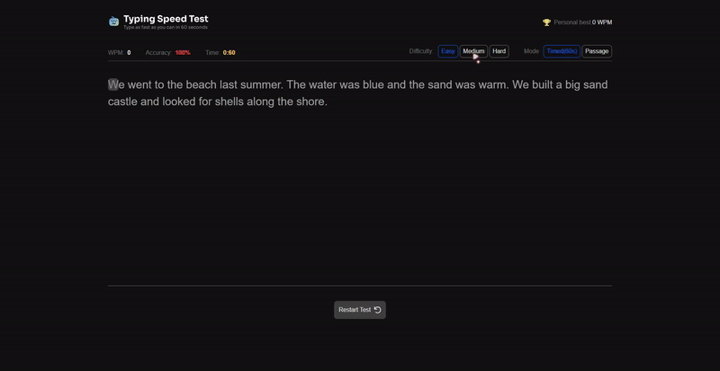

# Typing Test App

A responsive typing app built for Hackathon from front end mentor it provide a realtime feed back based on user performance 

### Core Feature
- Typing experience: Type directly on the paragraph with seamless focused UI and get the different color output based on the correct char
- Realtime monitoring: Monitor WPM and Accuracy as user type
- Result : Show wpm, raw wpm, accuracy result
- Fully responsive layout for mobile

### Challenge
- I think the The primary challenge was efficiently comparing user input against the source passage in real-time. The solution i use is using `array.reduce` where my input iterate thought the provided passage and every time meet !== or === condition will add to the correct and wrong variable

### Tech Used
- **Framework**: React 19 with compiler 
- **Styling**: Tailwind CSS
- **Language**: Typescript

### Library Used
- [Lucide React](https://lucide.dev/guide/packages/lucide-react)

### Preview

### Quick Start
1. `git clone https://github.com/Zer0-Gravity/mini-react-project`
2. `cd mini-react-project/note-taking-app`
3. `npm install`
4. `npm run dev`